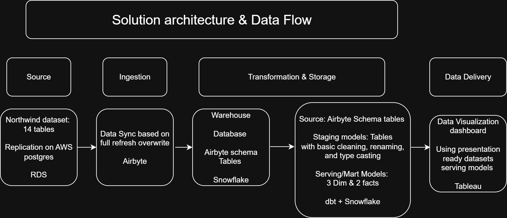
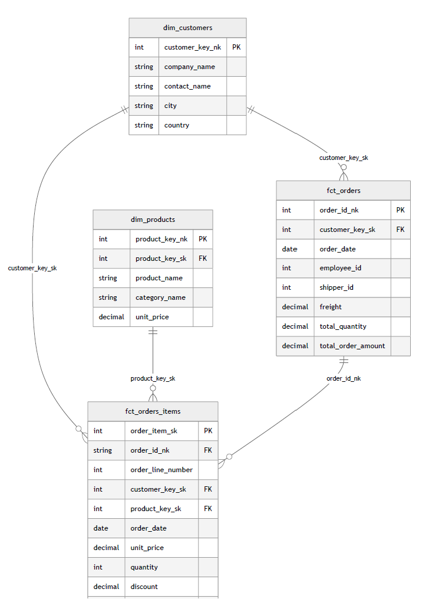

## Summary
This project showcases a cloud‑based, high‑performance data pipeline built during the [**Data Engineer Camp (DEC)**](https://dataengineercamp.com/) using the ["Northwind"](https://github.com/pthom/northwind_psql) database. The challenge was to design a multi‑layer **ELT pipeline** enabling easy access for business analysts through BI tools like Preset, Power BI, or Tableau. Though the dataset and questions are illustrative, the engineering methods applied reflect industry best practices.  

## Objective
The pipeline delivers business transaction records to BI analysts, enabling them to answer core business questions listed below. It also supports flexible slice‑and‑dice analysis across multiple attributes within BI tools like Tableau, Preset, or Power BI.

   + What are the top 10 countries generating the highest sales?
   + What are the Top 10 highest selling products? 

## Consumers

BI analysts will consume the data via BI tool like Tableau. 

## Source Dataset

This project uses the classic Northwind Traders database, created by Microsoft to model fictitious sales data: https://github.com/pthom/northwind_psql

## Solution architecture & data flow from source to BI-tool
The diagram below shows the components and services integrated to build the solution, from source to BI tool.

## Dimensional modeling (fact and dimensional tables)
The resulting dimensional model is visualized in the Entity Relationship Diagram (ERD) below. In this diagram, FK denotes Foreign Key, SK denotes Surrogate Key, and NK denotes Natural Key.

